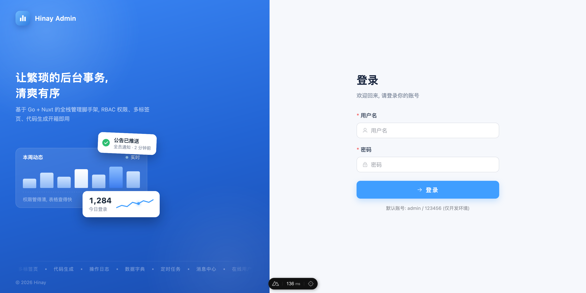
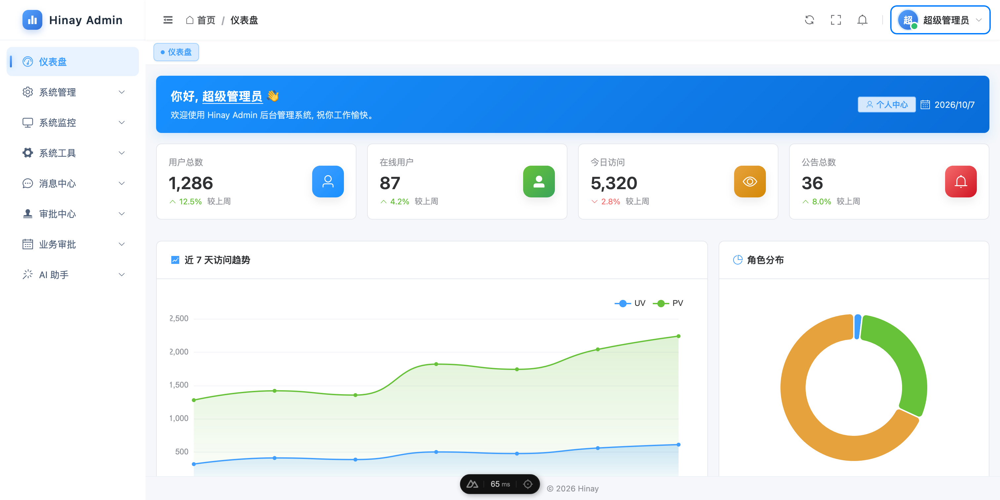
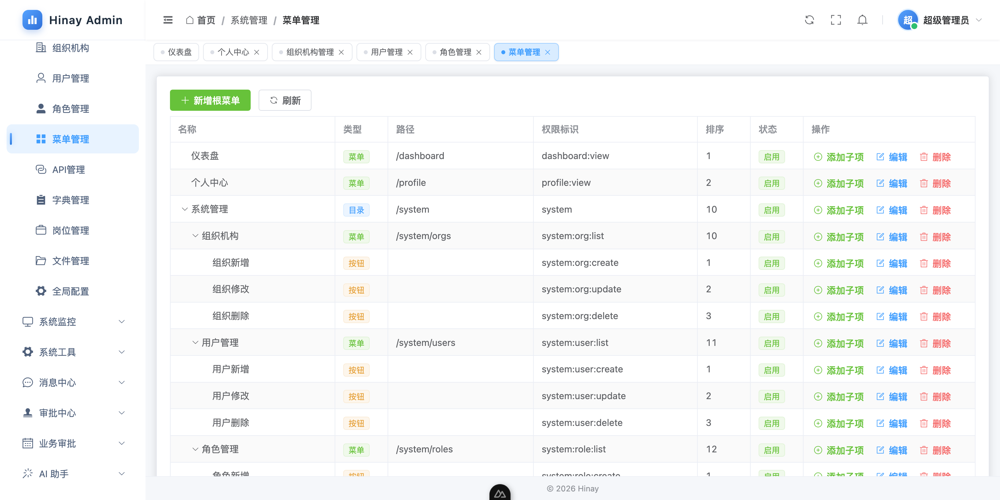
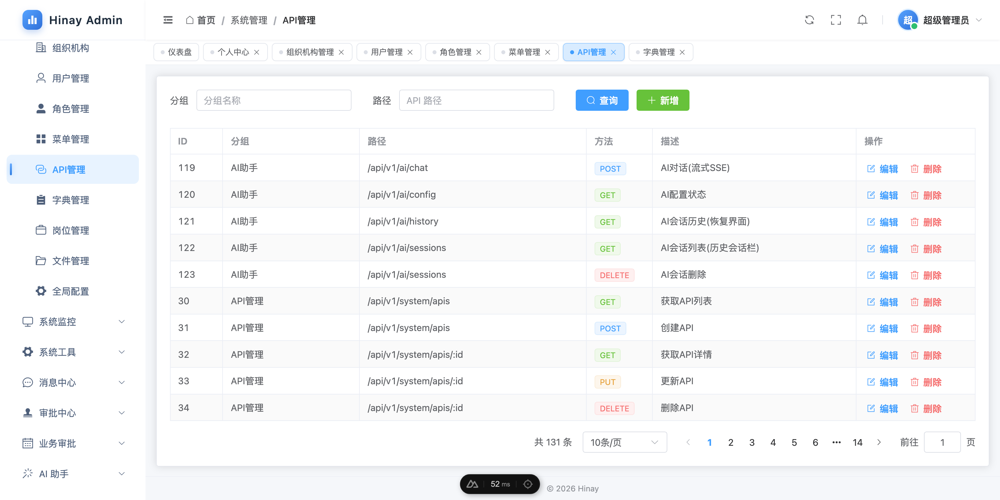
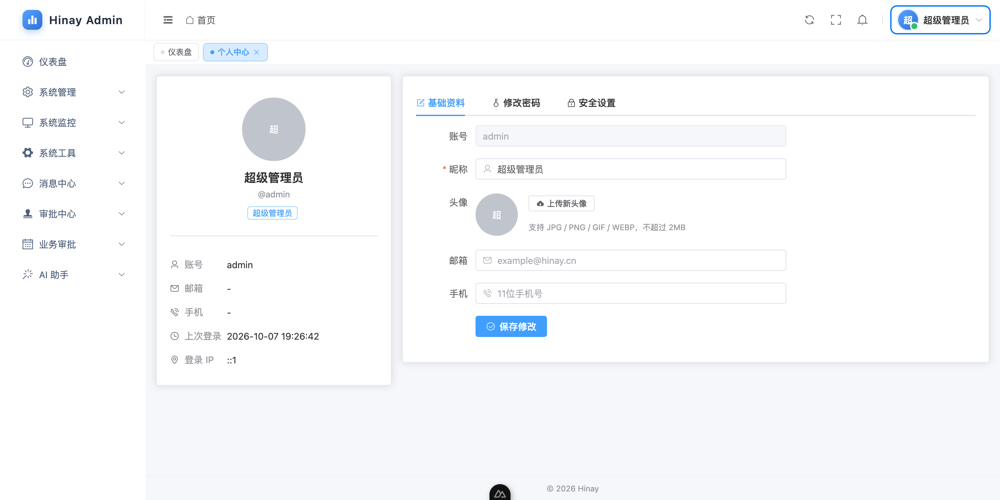
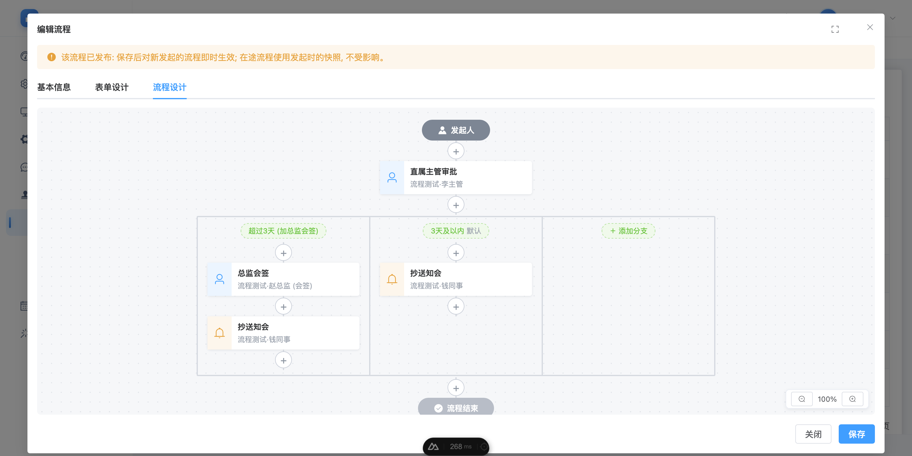
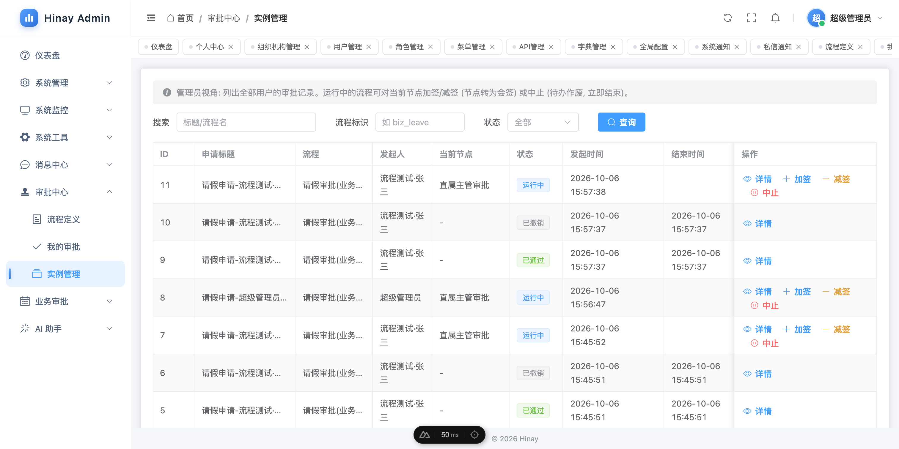
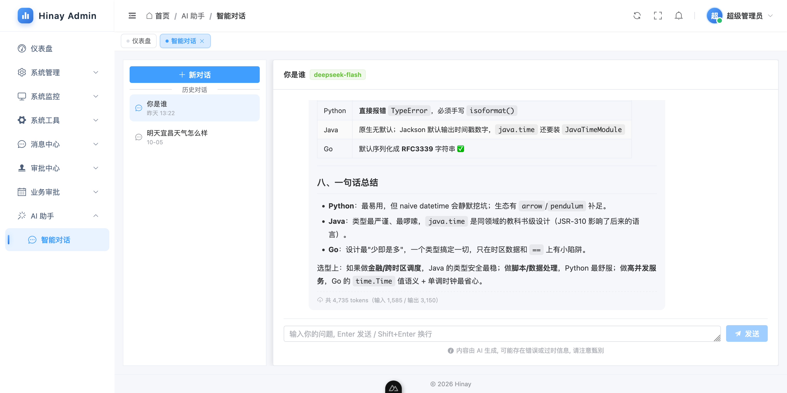

# Hinay Admin

通用后台管理系统脚手架, 前后端分离架构。

- 后端: Go 1.26 + GoFrame v2.10 + MySQL + Redis + JWT + Casbin v2
- 前端: Nuxt 4 + Vue 3 + Element Plus + Pinia + ECharts (TypeScript)

## 功能特性

- 完整的 RBAC 权限模型 (用户 / 角色 / 菜单 / API 资源 四套件)
- JWT 登录鉴权 + Token 自动续签 (401 静默刷新) + Redis 黑名单退出
- Casbin **双维度** 权限校验 (菜单维度 `menu:<id>` + API 维度 `path/method`)
- 全局限流: 按客户端 IP 的内存令牌桶 (`ratelimit.*` 配置, 默认 100 req/s + 200 突发), 超限 429
- 动态侧边栏菜单 + 前端 `v-permission` 按钮级权限
- 多标签页管理: 已访问页面标签化 (KeepAlive 按标签缓存, 状态保留) + 右键菜单 (刷新/关闭当前/关闭其他/关闭全部), 仪表盘固定标签
- 图标可视化选择器 (Element Plus 全图标库, 支持搜索)
- 消息中心: 系统通知 (全员/角色/用户) + 私信 + 收件箱 + 已读/未读统计 + SSE 实时推送 (断线退避重连 + 轮询兜底; 连接配额: 每用户 3 条/全局 1000 条/单连接 1h 到期收流重连, 超限 429)
- 在线用户管理: Redis 会话跟踪 + 心跳活跃时间 + 强制下线 (黑名单即时失效)
- 定时任务管理: gcron 调度 + 网页端配置/一键启停/立即执行 + 执行日志 + 内置日志清理处理器
- 组织数据权限: 角色 `data_scope` (全部/自定义组织/本部门/本部门及以下/仅本人), 多角色并集, `DataScope().Apply()` 一行接入业务查询
- Excel 通用导入导出 (`utility/excelx`): 表头加粗/列宽自适应/中文附件名下载; 用户列表导出 + 用户导入(含模板下载/行级错误报告) 示例
- 审计字段自动填充: 业务表统一带 `create_id`/`update_id` (`internal/logic/ormfill` 按 gdb 接口回调重写 mysql 驱动 DoInsert/DoUpdate), INSERT/UPDATE 自动记录操作人, 业务层零感知, `gf gen dao` 免维护
- 密码策略 (配置驱动 `sys.password.*`): 复杂度校验(长度/大小写/数字/特殊字符) + 有效期 + 管理员创建/重置/导入后首登强制改密, 前端锁定改密页 + 后端中间件拦截业务 API 直至完成 (账号禁用/删除亦实时失效)
- 个人中心: 资料修改 + 密码修改 + 头像上传 + 上次登录时间/IP + 安全设置
- 登录两步验证 (TOTP 2FA): 个人中心扫码/手输密钥绑定, 解绑须校验动态码; 登录密码通过后签发一次性票据换取动态码二次验证 (票据 5 分钟有效 + 单票据 5 次失败上限 + 时间步防重放), 演示模式下禁止绑定/解绑 (`logic/twofactor`)
- 字典管理 (类型 + 数据项, 支持批量排序)
- 文件管理 (上传 / 列表 / MIME 过滤)
- 全局配置 (键值对, 多类型支持: 文本 / 数字 / 布尔 / JSON)
- 配置驱动界面: 站点名称 / Logo / 页脚版权取自 `sys_config`, 作用于侧边栏品牌区 / 登录页 / 浏览器标题 / 仪表盘, 配置管理页修改后即时生效
- 操作日志 (自动记录 POST/PUT/DELETE)
- 登录日志 (登录成功/失败异步落库, 记录 IP/UA/失败原因, 按条删除)
- 统一软删除规范: 所有核心表带 `deleted_at`
- 统一响应协议 `{ code, message, data }`
- 中间件链: CORS / RequestId / 全局限流 / 安全响应头 / 操作日志 / JWT 鉴权 / Casbin 权限
- 代码生成器 (CLI + 网页版): 见下方「CRUD 代码生成」
- GoFrame 工程化分层: `api -> controller -> service -> logic -> dao` (gen ctrl / gen dao / gen service)
- 自由审批流: 表单/流程可视化设计器, 发起/审批/驳回/转办/加签/减签/中止, 会签与或签, 审批人支持指定岗位与部门主管解析, 审批中心 (我的审批 / 实例管理); 业务审批标准模板见 `docs/flow-template.md` (内置请假申请 Demo)
- 岗位管理 (`sys_post`): 用户挂多岗位, 作为审批流「指定岗位」审批人的解析依据
- AI 智能对话: OpenAI 兼容接口 (langchaingo), 会话 MySQL 持久化, 推理思考过程 / 工具调用 / token 用量展示
- 微信公众号回调 (验签 + Echo 回复, 占位可扩展)

## 界面截图

| 登录 | 仪表盘 |
| --- | --- |
|  |  |

| 菜单管理 | API管理 |
| --- | --- |
|  |  |

| 个人中心 | 流程定义 |
| --- | --- |
|  |  |

| 实例管理 | 智能对话 |
| --- | --- |
|  |  |

## 目录结构

```
hinay-admin/
├── server/                              # Go 后端 (GoFrame v2)
│   ├── api/                             # API 接口契约 (Req/Res + g.Meta 路由)
│   │   ├── auth/v1                      #   登录/登出/当前用户/菜单/个人中心
│   │   ├── message/v1                   #   消息中心 (系统通知 + 私信 + 收件箱)
│   │   └── system/v1                    #   用户/角色/菜单/API/字典/文件/配置/操作日志/登录日志/在线用户/定时任务/代码生成
│   ├── internal/
│   │   ├── cmd                          # 启动入口 + 路由分组
│   │   ├── controller/                  # 控制器层 (单方法薄透传, gf gen ctrl 生成)
│   │   │   ├── auth                     #   鉴权
│   │   │   ├── message                  #   消息
│   │   │   └── system                   #   系统管理全模块
│   │   ├── service/                     # 业务接口层 (IAuth/IMessage/IUser/IRole/IMenu/IApi/IDict/IFile/IConfig/IAuditLog)
│   │   ├── logic/                       # 业务实现层 (sXxx + init 注册到 service)
│   │   │   ├── auth                     #   登录/登出/菜单树/个人资料/改密/头像
│   │   │   ├── system                   #   用户/角色/菜单/API/字典/文件/配置/审计日志/登录日志
│   │   │   ├── message                  #   消息通知 (含收件箱权限路由)
│   │   │   ├── online                   #   在线会话 (Redis 注册/心跳/强制下线)
│   │   │   ├── job                      #   定时任务调度 (gcron + 执行日志 + 处理器注册表)
│   │   │   ├── datascope                #   组织数据权限 (范围并集计算 + 查询注入)
│   │   │   ├── pwdpolicy                #   密码策略 (配置驱动复杂度/有效期)
│   │   │   ├── twofactor                #   TOTP 两步验证 (绑定/解绑/登录校验/防重放)
│   │   │   ├── notify                   #   SSE 推送枢纽 (按用户订阅/发布)
│   │   │   ├── gencode                  #   网页版代码生成 (表/列/预览/zip/直写)
│   │   │   ├── ormfill                  #   审计字段自动填充 (重写 mysql 驱动 DoInsert/DoUpdate)
│   │   │   └── casbinx                  #   Casbin enforcer + 策略读写
│   │   ├── dao/                         # 数据访问对象 (gf gen dao 自动生成, 禁止手改)
│   │   ├── model/                       # 实体 + DO + 业务 DTO
│   │   ├── middleware                   # CORS / RequestId / 全局限流 / 安全头 / 操作日志 / Auth / Casbin
│   │   ├── consts                       # 常量与上下文 Key
│   │   └── packed                       # 注册 MySQL/Redis 驱动
│   ├── utility/
│   │   ├── jwtx                         # JWT 签发/校验/黑名单
│   │   ├── crudgen                      # CRUD 代码生成核心 (DDL 解析/模板/渲染/写盘/zip, CLI 与网页共用)
│   │   ├── excelx                       # Excel 通用导入导出
│   │   ├── password                     # bcrypt
│   │   ├── rsax                         # 登录密码一次性 RSA 加解密
│   │   ├── mimeutil                     # 上传文件头内容嗅探
│   │   ├── response                     # 统一响应 / 分页结构
│   │   ├── contextx                     # ctx 取登录用户/Token 工具
│   │   └── xerror                       # 错误码与包装
│   ├── tools/crudgen/                   # 代码生成 CLI 入口 (make gen-crud)
│   ├── manifest/
│   │   ├── config/config.yaml           # 运行时配置 (server/db/redis/jwt/casbin/ratelimit/gencode)
│   │   └── sql/
│   │       ├── init.sql                 # 全新安装唯一入口: 基础库 + 全部模块 DDL/种子
│   │       └── demo/                    # 可选演示种子 (流程测试账号/请假Demo演示定义)
│   └── Makefile                         # run / initdb / vet / fmt / tidy / gen-crud
└── web_src/                             # Nuxt 4 前端
    ├── app/
    │   ├── app.vue                      # 根组件
    │   ├── layouts/                     # default(主骨架) / blank(登录)
    │   ├── pages/                       # 页面路由
    │   │   ├── login.vue                #   登录 (blank 布局)
    │   │   ├── dashboard.vue            #   仪表盘
    │   │   ├── profile.vue              #   个人中心 (资料+头像+密码+上次登录)
    │   │   ├── system/                  #   系统管理
    │   │   │   ├── users/index.vue      #     用户管理 (含 Excel 导入导出)
    │   │   │   ├── roles/index.vue      #     角色管理 (含数据范围/自定义组织)
    │   │   │   ├── orgs/index.vue       #     组织机构
    │   │   │   ├── menus/index.vue      #     菜单管理 (含图标选择器)
    │   │   │   ├── apis/index.vue       #     API 管理
    │   │   │   ├── dicts/index.vue      #     字典管理
    │   │   │   ├── files/index.vue      #     文件管理
    │   │   │   ├── configs/index.vue    #     全局配置 (含密码策略 sys.password.*)
    │   │   │   ├── audit-logs/index.vue #     操作日志
    │   │   │   ├── login-logs/index.vue #     登录日志
    │   │   │   ├── online/index.vue     #     在线用户 (强制下线)
    │   │   │   ├── jobs/index.vue       #     定时任务 (一键启停/立即执行/执行日志)
    │   │   │   └── gencode/index.vue    #     代码生成 (表选择/列勾选/预览/下载/直写)
    │   └── message/                     #   消息中心
    │       ├── system/index.vue         #     系统通知
    │       └── private/index.vue        #     私信
    │   ├── stores/                      #   user(会话/菜单/权限) / tags(多标签页) / config(全局配置)
    │   ├── components/                  #   MessageBell(SSE 消息铃铛) / TagsBar(多标签页)
    │   ├── composables/
    │   │   ├── useRequest.ts            # 统一请求封装 (token 注入 / 401 静默续期 / 文件下载)
    │   │   └── useApi/                  # 按模块拆分的 API hook (auth/user/role/.../gencode)
    │   ├── middleware/auth.global.ts    # 路由守卫 (未登录跳转 / 强制改密锁定改密页)
    │   └── plugins/
    │       ├── element-icons.ts         # 全局注册 @element-plus/icons-vue (侧边栏动态图标)
    │       ├── permission.ts            # v-permission 按钮级权限指令
    │       └── echarts.client.ts        # ECharts 客户端注册
    └── nuxt.config.ts                   # modules + nitro.devProxy
```

## 快速开始

### 1. 准备环境

- Go >= 1.26 (见 `server/go.mod`)
- Node.js >= 18 (推荐 20)
- MySQL >= 8.0 (兼容 5.7+)
- Redis >= 5.0

### 2. 初始化数据库

修改 `server/manifest/config/config.yaml` 中的 `database.default` 与 `redis.default` 连接参数, 然后执行:

```bash
cd server
make initdb DB_USER=root DB_PASS=yourpass DB_NAME=hinay_admin
# 或手动 (init.sql 为全量基线, 幂等可重跑):
mysql -uroot -p hinay_admin < manifest/sql/init.sql
```

`init.sql` 会创建以下表并写入种子数据:

| 表 | 说明 |
| --- | --- |
| `sys_user` | 系统用户 (含 `deleted_at` 软删) |
| `sys_role` | 系统角色 |
| `sys_menu` | 菜单/按钮 (`type` 1=目录 2=菜单 3=按钮) |
| `sys_api` | API 资源 (用于角色 API 维度授权) |
| `casbin_rule` | Casbin 策略 (p=权限, g=用户-角色) |
| `biz_message` | 消息主表 (系统通知 + 私信) |
| `biz_message_target` | 系统通知定向目标 (角色/用户) |
| `biz_message_read` | 消息已读关系 (含个人删除 `hidden`) |
| `sys_config` | 全局配置 (文本/数字/布尔/JSON 多类型) |
| `sys_dict_type` | 字典类型 |
| `sys_dict_data` | 字典数据项 (支持排序) |
| `sys_file` | 文件管理 |
| `sys_audit_log` | 操作审计日志 |
| `wf_definition`/`wf_instance`/`wf_task`/`wf_record` | 自由审批流 (定义/实例/任务/流转记录) |
| `sys_post`/`sys_user_post` | 岗位管理 (审批人解析依据) |
| `ai_conversation`/`ai_chat_message` | AI 会话与消息 |
| `biz_leave` | 请假 Demo (业务型流程审批)

> 历史的 `upgrade/` (社区版存量增量) 与 `upgrade-modules/` (模块增量 pNNN) 已全部并入
> `init.sql` —— 项目默认面向新装应用, 单文件完成初始化; 可选演示种子在 `demo/` 目录。

### 3. 启动后端

```bash
cd server
go mod tidy
make run                  # 或 go run main.go
# 默认监听 :8000, API 前缀 /api/v1, Swagger: /swagger, OpenAPI: /api.json
```

### 4. 启动前端

```bash
cd web_src
yarn install              # 或 npm install / pnpm install
yarn dev
# http://localhost:3000  (/api 已通过 nitro.devProxy 反代到 :8000)
```

> **本地预览生产构建时需要指定后端地址**: `nitro.devProxy` 仅在 `yarn dev` 模式生效,
> `yarn preview` / `node .output/server/index.mjs` 没有 `/api` 代理, 需通过环境变量指向后端:
>
> ```bash
> NUXT_PUBLIC_API_BASE=http://127.0.0.1:8000/api/v1 node .output/server/index.mjs
> ```
>
> Docker 部署无需此变量, 由 nginx 统一反代 `/api` 到后端。

### 5. 默认账号

```
账号: admin
密码: 123456
```

> 内置 `admin` 用户默认绑定 `admin` 角色, 不可禁用、不可解绑超管角色、不可删除。

## Docker Compose 部署

一键启动 MySQL、Redis、Go 后端、Nuxt 前端四个服务, 无需手动安装依赖。

### 1. 准备环境变量

```bash
cp .env.example .env
```

按需修改 `.env` 中的密码和密钥:

```bash
MYSQL_ROOT_PASSWORD=<强密码>                    # MySQL root 密码
MYSQL_DATABASE=hinay_admin                      # 数据库名
JWT_SECRET=<openssl rand -hex 32 生成>           # JWT 密钥, 必填且至少 32 位随机字符
DEMO_MODE=false                                 # 演示模式: true 时全局禁止修改/重置密码
```

### 2. 构建并启动

```bash
docker compose up -d --build
```

首次启动会自动:
- 拉取 MySQL 8.0、Redis 7、Node.js 22、Go 1.26 等基础镜像
- 编译 Go 后端二进制
- 构建 Nuxt 前端产物
- 初始化数据库 (执行全量基线 `init.sql`, 创建表和种子数据)

### 3. 访问

| 服务 | 地址 | 说明 |
| --- | --- | --- |
| 前端 | http://localhost | Nginx 反向代理入口 |
| 后端 API | http://127.0.0.1:8000/api/v1 | Go API 服务 (仅绑定回环, 供本机调试) |
| MySQL | localhost:3306 | 数据库 |
| Redis | localhost:6379 | 缓存 |

默认账号: `admin` / `123456` — 首次登录会被强制要求修改密码 (密码策略内置保护, 见「密码策略」)

> 公开演示部署可在 `.env` 中设置 `DEMO_MODE=true` 开启演示模式: 全局禁止修改/重置密码
> (个人中心改密与用户管理重置密码均返回 403), 同时屏蔽登录后的强制改密引导,
> 内置 `admin` 账号可一直以默认密码登录演示。

### 4. 常用命令

```bash
# 查看服务状态
docker compose ps

# 查看日志 (所有服务)
docker compose logs -f

# 查看单个服务日志
docker compose logs -f server
docker compose logs -f web

# 停止所有服务
docker compose down

# 停止并删除数据卷 (清空数据库)
docker compose down -v

# 重新构建某个服务
docker compose build server
docker compose up -d server
```

### 5. 文件说明

| 文件 | 说明 |
| --- | --- |
| `docker-compose.yml` | 服务编排, 定义四个服务及依赖关系 |
| `.env` / `.env.example` | 环境变量 (密码、密钥等) |
| `server/Dockerfile` | Go 后端多阶段构建 |
| `server/manifest/config/config.docker.yaml` | Docker 环境专用配置 (host 为容器名, 密码通过环境变量注入) |
| `web_src/Dockerfile` | Nuxt 前端多阶段构建 (Node + Nginx) |
| `web_src/nginx.conf` | Nginx 配置, `/api` 和 `/upload` 转发到后端 |

> 生产部署时, 请务必修改 `.env` 中的 `MYSQL_ROOT_PASSWORD` 和 `JWT_SECRET`。

## 配置说明

`server/manifest/config/config.yaml` 主要项:

```yaml
server:
  address: ":8000"
  openapiPath: /api.json
  swaggerPath: /swagger
  dumpRouterMap: true

database:
  default:
    type: mysql
    host: 127.0.0.1
    port: "3306"
    user: root
    pass: "yourpass"
    name: hinay_admin
    charset: utf8mb4

redis:
  default:
    address: 127.0.0.1:6379
    db: 0

jwt:
  secret:    "hinay-admin-please-change-me"
  expireSec: 86400          # token 过期时间(秒) 24h
  issuer:    "hinay-admin"
  header:    "Authorization"

casbin:
  enable: true
  model: |
    [request_definition]
    r = sub, obj, act
    [policy_definition]
    p = sub, obj, act
    [role_definition]
    g = _, _
    [policy_effect]
    e = some(where (p.eft == allow))
    [matchers]
    m = g(r.sub, p.sub) && keyMatch2(r.obj, p.obj) && (r.act == p.act || p.act == "*")
```

> Casbin 模型使用 `g(r.sub, p.sub)`, 因此 `sub` 直接传 `用户ID`, 由 g 策略自动解析其角色。
> g/p 关联键均为 ID (十进制字符串), 与用户名/角色 code 解耦, 改名不影响权限。

## 接口规范

- 鉴权: HTTP Header 加 `Authorization: Bearer <token>`
- 响应: `{ "code": 0, "message": "ok", "data": ... }`, 业务错误 `code` 非 0
- 错误码: 见 [`server/utility/xerror/xerror.go`](server/utility/xerror/xerror.go)
- 鉴权失败统一返回 401 (`40100`), 无权限返回 403 (`40300`); 前端 401 自动尝试静默续签 Token
- 分页响应统一 `response.PageResult { list, total, page, pageSize }`

### 主要接口一览

| 模块 | 路径 | 方法 | 说明 |
| --- | --- | --- | --- |
| 鉴权 | `/api/v1/auth/public-key` | GET | 获取一次性登录加密公钥 (公开, 单 IP 限流) |
| 鉴权 | `/api/v1/auth/login` | POST | 登录 (公开, 密码须用公钥 RSA 加密后提交) |
| 鉴权 | `/api/v1/auth/refresh` | POST | 刷新 Token |
| 鉴权 | `/api/v1/auth/logout` | POST | 登出 (Token 加 Redis 黑名单) |
| 鉴权 | `/api/v1/auth/userInfo` | GET | 当前用户信息 |
| 鉴权 | `/api/v1/auth/menus` | GET | 当前用户菜单 + 权限码 |
| 鉴权 | `/api/v1/auth/profile` | GET / PUT | 个人中心详情 / 修改资料 |
| 鉴权 | `/api/v1/auth/password` | PUT | 修改密码 |
| 鉴权 | `/api/v1/auth/avatar` | POST | 上传头像 |
| 用户 | `/api/v1/system/users` | GET / POST | 列表 / 新增 |
| 用户 | `/api/v1/system/users/{id}` | GET / PUT / DELETE | 详情 / 修改 / 软删 |
| 用户 | `/api/v1/system/users/{id}/password` | PUT | 重置密码 |
| 角色 | `/api/v1/system/roles` (含 `/all`) | CRUD | 列表 / 全量 / CRUD |
| 角色 | `/api/v1/system/roles/{id}/menus` | GET / PUT | 获取/分配菜单权限 |
| 角色 | `/api/v1/system/roles/{id}/apis` | GET / PUT | 获取/分配 API 权限 |
| 菜单 | `/api/v1/system/menus` (含 `/tree`) | CRUD | 扁平/树形/CRUD |
| API 资源 | `/api/v1/system/apis` | CRUD | API 接口资源管理 |
| 字典类型 | `/api/v1/system/dict-types` (含 `/all`) | CRUD | 字典类型管理 |
| 字典数据项 | `/api/v1/system/dict-types/{typeId}/items` | CRUD | 字典数据项管理 (含排序) |
| 字典全量 | `/api/v1/system/dicts/all` | GET | 全量字典数据 (按类型分组) |
| 文件 | `/api/v1/system/files` | GET | 文件列表 |
| 文件 | `/api/v1/system/files/upload` | POST | 上传文件 |
| 文件 | `/api/v1/system/files/{id}` | DELETE | 删除文件 |
| 全局配置 | `/api/v1/system/configs` (含 `/all`) | CRUD | 全局配置管理 |
| 操作日志 | `/api/v1/system/audit-logs` | GET | 操作日志列表 |
| 消息 | `/api/v1/message` | GET | 管理员消息列表 |
| 消息 | `/api/v1/message/system` | POST | 发布系统通知 |
| 消息 | `/api/v1/message/private` | POST | 发送私信 |
| 消息 | `/api/v1/message/inbox` | GET | 我的收件箱 |
| 消息 | `/api/v1/message/inbox/{id}` | GET / DELETE | 阅读详情(自动已读) / 个人删除 |
| 消息 | `/api/v1/message/{id}/read` | PUT | 标记单条已读 |
| 消息 | `/api/v1/message/read-all` | PUT | 全部标记已读 |
| 消息 | `/api/v1/message/unread-count` | GET | 未读消息数量 |

## 鉴权与权限模型

请求链路 (见 [`internal/cmd/cmd.go`](server/internal/cmd/cmd.go) 与 [`internal/middleware/middleware.go`](server/internal/middleware/middleware.go)):

```
CORS -> RequestId -> MiddlewareHandlerResponse -> Auth -> Casbin -> Controller
```

- **Auth**: 解析 JWT, 校验 Redis 黑名单, 写入 LoginUser 到 ctx; 命中 `publicPaths` (如 `/auth/login`) 直接放行。
- **Casbin**: 校验 `(用户ID, path, method)`; 超管 (内置角色 id=1) 全放行; 命中 `authWhitelist` (如 `/auth/menus`、`/auth/userInfo`、`/auth/profile`、`/auth/password`、`/auth/logout`) 已登录即可访问, 不进入策略检查。
- **双维度授权** (关联键均为 ID, 角色 code 仅为展示标识):
  - 菜单维度: `p, <角色ID>, menu:<menuId>, *`  → 控制可见菜单与按钮权限码
  - API 维度: `p, <角色ID>, <apiPath>, <method>` → 控制实际 HTTP 接口
  - 用户-角色: `g, <用户ID>, <角色ID>` → 在 g 策略中维护
- **多角色取并集 (只扩权, 不缩权)**: 用户挂多个角色时, 功能权限按"任一角色授权即放行"合并:
  - API 维度: casbin model 的 policy_effect 为 `some(where (p.eft == allow))` (OR 语义), 任一角色的 `p` 行命中即通过 (path 用 `keyMatch2` 匹配, act 支持 `*` 通配); 内存未命中时的 DB 兜底查询 (`casbinx.Enforce`) 同为并集语义;
  - 菜单/权限码: `/auth/menus` (`logic/auth/auth.go` 的 `MenuTree`) 逐角色收集菜单 ID 与按钮权限码, 合并去重后返回;
  - 因此给用户增加角色只会扩大可见/可调用范围, 永不缩小; 收紧权限只能从角色上移除授权或解除用户-角色绑定。
- **前端**:
  - 登录后调用 `/auth/menus` 拉取 `{ menus, permissions }`
  - 路由按 `menus` 动态注入, 按钮用 `<el-button v-permission="'system:user:create'">`
  - 401 响应自动触发静默 Token 续签, 续签失败跳转登录页
  - 侧边栏菜单图标通过全局注册 `@element-plus/icons-vue` 动态渲染

## 二次开发

> 项目遵循 GoFrame v2 强规范化实践: 严禁 `g.DB().Model("xxx")` 形式硬编码表名, 数据访问统一走 `dao.Xxx.Ctx(ctx)`。详见 [memory: GoFrame v2项目开发强制规范]。

新增业务模块的标准步骤 (以 `message` 模块为参考):

1. **DDL**: 在 `server/manifest/sql/init.sql` 增加表与索引, 字段含 `deleted_at`, 顺便加初始菜单/权限码/API 资源 (项目默认面向新装应用, 不另维护存量增量脚本)。
2. **生成 dao/model**: 配好数据库后执行 `gf gen dao`, 自动生成 `internal/dao/<table>.go` 与 `internal/model/{do,entity}/<table>.go`。
3. **API 契约**: 在 `server/api/<module>/v1/` 编写 `XxxReq/XxxRes`, 用 `g.Meta` 声明 path/method/tags/summary, 加 `v` 校验规则。
4. **service 接口**: 在 `server/internal/service/<module>.go` 定义 `IXxx interface { Method(ctx, *v1.XxxReq) (*v1.XxxRes, error) }` + `localXxx` 单例 + `Xxx()` 取值 + `RegisterXxx(i IXxx)`。
5. **logic 实现**: 在 `server/internal/logic/<module>/` 写 `sXxx struct{}` 实现接口, `init()` 注册 `service.RegisterXxx(NewXxx())`, 数据库访问走 `dao.Xxx.Ctx(ctx)`。
6. **controller**: 执行 `gf gen ctrl` 生成 `internal/controller/<module>/<module>_v1_*.go`, 每个方法单行透传 `return service.Xxx().Method(ctx, req)`。
7. **绑定路由**: 在 `internal/cmd/cmd.go` 的 `sec.Bind(...)` 中加入 `<module>.NewV1()` (公开接口在 `middleware.publicPaths` 白名单短路)。
8. **前端**: `composables/useApi.ts` 新增 hook + `pages/<module>/index.vue` 页面。
9. **授权**: 通过菜单管理与角色管理为对应角色分配菜单权限码与 API 权限即可生效。

新增**定时任务处理器** (以数据同步任务为例, 网页端"定时任务"页配置调度, 无需改框架代码):

1. **写处理器** (唯一的代码工作), 签名 `func(ctx context.Context, params string) (string, error)`:
   - params 用 JSON 承载配置 (如 `{"source":"erp","batch":500}`), 网页端可改参数不必改代码;
   - 返回有价值的输出摘要 (如 `同步完成: 拉取 1200 条, 新增 35, 更新 12`), 写入执行日志「输出/原因」列;
     同时保留 `g.Log()` 双通道 (应用日志供服务端排障);
   - 同步类任务做成**幂等** (按业务键 upsert); 执行重叠无需自行处理, 调度器为 AddSingleton,
     上一轮未结束不会触发下一轮。
2. **注册处理器**: 业务包 `init()` 中调用包级 `job.RegisterHandler("模块.动作", 处理函数)`
   (命名习惯 `sync.externalData`); 用包级入口而非 `service.Job()` 注册——Go 保证被依赖包先初始化,
   规避顺序陷阱。处理器放在**新的** logic 包时, 需在 `internal/logic/logic.go` 补一行空导入。
3. **重启后端**: 注册发生在进程启动时, 重启后处理器名才会出现在任务页下拉框。
4. **网页端配置**: 定时任务页 → 新增 → 选处理器/填任务名/cron (可视化生成器一键"每小时/每天"再微调)
   /参数 JSON; 新增任务默认**暂停**。
5. **验证上线**: 点"执行"立即跑一次 → 日志抽屉看输出摘要 → 确认后打开开关启动;
   之后每次触发 (定时/手动) 均有执行日志 (结果/输出/耗时)。

边界提醒: 多副本部署时每个实例**各自跑一份** (gcron 单机调度), 同步任务在该部署下需自行加分布式锁
(如 Redis SETNX); 依赖外部系统时把超时控制在自己手里, 避免一轮卡死表现为执行耗时异常长。

脚手架内置处理器可直接使用: `demo.echo` 与 `job.cleanLoginLog` / `job.cleanAuditLog` / `job.cleanJobLog`
(params: `{"days": 90}`, 输出形如"清理 sys_login_log 90 天前日志, 删除 N 行")。

**Excel 导入导出接入** (工具: `utility/excelx`):

- **导出**: 组好 `headers []string` 与 `rows [][]any` 后调用 `excelx.Build("Sheet名", headers, rows)` 得到字节流, 再 `excelx.WriteToResponse(ctx, "文件名.xlsx", content)` 直接写入响应 (GoFrame 检测到缓冲已有内容时自动跳过 JSON 包装)。示例见 `logic/system/user.go` 的 `Export`。
- **导入**: 接口入参用 `*ghttp.UploadFile`, `excelx.Read(content)` 取回字符串二维表 (含表头), 逐行校验后写入; 建议提供配套模板下载端点 (同样用 `Build` 生成) 并返回行级错误明细。示例见 `Import` / `ImportTemplate`。

**网页版代码生成** ("代码生成"页, 配置开关 `gencode.enable`, 默认关闭): 从 `information_schema` 选表 → 配置模块名/标题/列勾选(列表/表单/搜索) → 预览全部生成文件 → **zip 下载**(含 README 接线说明, 任何环境可用) 或 **直写源码树**(自动接线, 仅后端从源码目录启动的开发环境, 容器内自动拒绝)。生成产物与 CLI 完全一致 (共用 `utility/crudgen` 核心)。

**CRUD 代码生成器 CLI** (`server/tools/crudgen`, 无需连库): 从 `init.sql` 解析表 DDL, 一条命令生成完整增删改查——API 契约/控制器/service/logic/model 三件套/DAO 两件套/前端 API+页面/菜单按钮 API Casbin 种子 SQL, 并自动接线 `logic.go`、`cmd.go`、`useApi/index.ts`:

```bash
cd server
make gen-crud TABLE=biz_article TITLE="文章管理"          # 生成 (mod 默认取表名去前缀)
make gen-crud TABLE=biz_article TITLE="文章管理" DRY=1    # 仅预览
```

生成约定: 表需含 `id` 主键与 `created_at/updated_at/deleted_at`; 菜单 ID 自动选取空闲千位块; `create_id/update_id` 由 ormfill 自动填充; 生成后执行 `manifest/sql/gen/` 下产出的 SQL 并分配角色权限即可。演示见 `-dry` 输出。

**sys_api 种子 SQL 生成器** (`server/tools/genapi`, 无需连库): CRUD 生成器产出的升级 SQL 自带 sys_api 行, 但**手写** API 契约 (如审批流加签/减签) 的 `sys_api` INSERT 行此前需手工编写, 路径/方法/描述容易抄漏。本工具扫描 `api/` 目录下所有 `g.Meta` 路由标签, 自动生成幂等的 `INSERT IGNORE` 种子块:

```bash
cd server
make gen-api-sql                       # 全量路由 → stdout (135+ 条, 按分组排序对齐)
make gen-api-sql PKG=flow              # 只生成 api/flow 模块
make gen-api-sql PKG=flow OUT=manifest/sql/gen/xxx_api.sql   # 直接写种子脚本
make gen-api-sql CHECK=1               # 对照 manifest/sql 种子, 报告尚未入库的路由 (缺则退出码 1, 可当提交前检查)
```

说明: 分组名默认按 `tags` 映射为中文 (`Flow=审批中心` 等, 全表见工具内 `defaultGroupNames`, 可用 `-map New=新模块` 覆盖); 路径参数沿用 `g.Meta` 的 `{id}` 花括号风格, Casbin 匹配器已同时兼容 `:id` 与 `{id}`; `-check` 曾一次性发现 10 条历史漏种 (TOTP/SSE/头像等), 已并入 `init.sql` 的 sys_api 种子块。

**密码策略**: 全局配置页修改 `sys.password.*` 即时生效——
- 复杂度: `min_length`/`max_length`/`require_upper`/`require_lower`/`require_digit`/`require_special`, 校验挂在改密/创建用户/重置密码/Excel 导入四处 (`logic/pwdpolicy`);
- 有效期: `expire_days` (0=永不过期), 过期后登录强制改密;
- 强制改密: 管理员创建用户/重置密码/导入用户后, 该用户 `must_change_pwd=1`, 下次登录前端路由守卫锁定到个人中心改密页, 改密成功后自动放行并回到来源页; 内置 admin 种子即启用 (公开默认密码首登必须改)。

**审计字段 `create_id` / `update_id`** (业务层零感知): 新业务表的 DDL 带上这两列 (`BIGINT UNSIGNED NOT NULL DEFAULT 0`), 并把表名登记进 `internal/logic/ormfill` 的 `fillTables` 白名单即自动生效: INSERT 补 `create_id`+`update_id`, UPDATE 补 `update_id`, 取当前登录用户 (后台写入保持 0)。实现上按 [gdb 接口回调](https://goframe.org/docs/core/gdb-interface-callback) 继承 mysql 驱动重写 `DoInsert`/`DoUpdate` 并以 "mysql" 名覆盖注册, 与 `gf gen dao` 完全解耦。数据权限 (数据范围过滤) 与此独立, 需要的业务查询自行调用 `service.DataScope().Apply(...)`。

**组织数据权限接入** (`logic/datascope`, 角色管理里的"数据范围"下拉即此配置):

角色以 `sys_role.data_scope` 声明数据范围, 共五档; 一个用户多个角色的范围**取并集** (与功能权限一致, 只扩权不缩权):

| data_scope | 含义 | 生成的过滤条件 |
|---|---|---|
| 1 | 全部数据 | 不加条件 |
| 2 | 自定义组织 | `org_id IN (sys_role_org 绑定的组织)` |
| 3 | 本部门 | `org_id IN (用户所在组织)` |
| 4 | 本部门及以下 | `org_id IN (本组织 + 全部后代, 内存 BFS)` |
| 5 | 仅本人 | `create_id = 当前用户ID` |

合并规则: 各角色算出的可见组织 ID 归并去重; 任一角色为"全部"则整体放行; "仅本人"与组织范围并存时叠加为 `(create_id = ? OR org_id IN(...))`。仅**启用状态**的角色参与计算; 无角色按"仅本人"; 内置超管角色 (id=1) 恒为全部 (与 Casbin 全局放行一致); 最终范围为空时套恒假条件 `1=0` (fail-close, 宁可查不到也不多看)。

数据权限不是中间件, **不会自动生效**——需要过滤的查询在 logic 层自行调用。接入前提: 业务表带 `org_id` 字段, 且已登记 `create_id` 审计字段 (见上节 ormfill), 然后在查询上叠加一行:

```go
q := dao.Xxx.Ctx(ctx).Where("deleted_at IS NULL")
if req.Keyword != "" {
    q = q.Where("name LIKE ?", "%"+req.Keyword+"%")   // 业务过滤条件照常
}
// 一行接入: 返回追加了范围条件的新 q, 后续 Count/分页查询共用同一份 q
q, derr := service.DataScope().Apply(ctx, q, "org_id", "create_id")
if derr != nil {
    return nil, xerror.Wrap(xerror.CodeBusinessError, derr, "数据权限计算失败")
}
total, err := q.Ctx(ctx).Count()                      // 总数同样受限
if err = q.Ctx(ctx).Page(req.Page, req.PageSize).Order("id DESC").Scan(&rows); err != nil {
    return nil, xerror.Wrap(xerror.CodeBusinessError, err, "查询失败")
}
```

要点:

- `Apply(ctx, m, orgColumn, selfColumn)`: `orgColumn` 传业务表的组织字段 (通常 `org_id`); `selfColumn` 传"仅本人"的比对字段——一般业务表传 `create_id` (即数据创建者, ormfill 自动填充), "行即人"的表 (如 `sys_user` 本身) 传 `id`。
- 两个列名只允许来自代码, 不允许来自外部输入 (会直接拼进 SQL)。
- 列表/导出/按 ID 取详情等**一切会吐数据的查询**都要套同一过滤, 否则列表里看不到的数据换个 ID 直查仍可读; 内置范例见 `logic/system/user.go` 的 `List` 与 `Export`。
- 需要拿原始范围自行处理 (如前端展示、跨表手工拼条件) 时用 `service.DataScope().OrgScope(ctx)` 取 `All/Self/OrgIds`。

## 常用命令

```bash
# 后端
cd server
make run            # go run main.go
make initdb         # 初始化数据库 (全新安装, 执行全量基线 init.sql)
make vet            # go vet ./...
make fmt            # gofmt -s -w .
make tidy           # go mod tidy
make gen-crud TABLE=biz_xxx TITLE="xx管理"   # CRUD 代码生成 (DRY=1 仅预览)

# 数据库说明
# init.sql 为全量基线 (基础库 + 审批流/岗位/AI/微信/请假Demo 模块), 新装一个文件完成;
# 历史 upgrade / upgrade-modules 增量脚本已并入基线并移除; 可选演示种子在 manifest/sql/demo/

# 前端
cd web_src
yarn dev            # 开发
yarn build          # 生产构建 (产物 .output/)
yarn generate       # 静态生成
```

## License

[Apache License 2.0](LICENSE)
